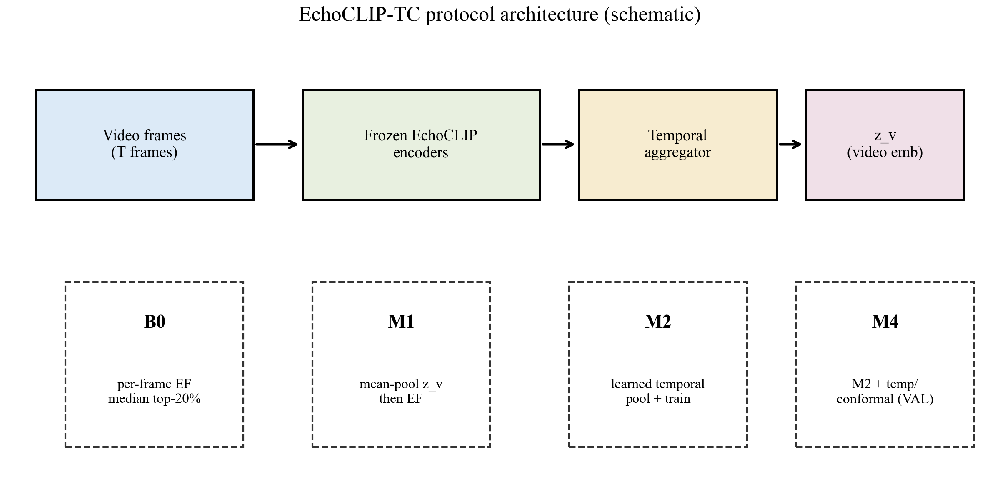
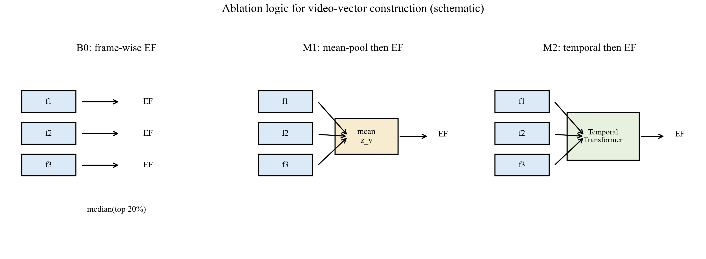
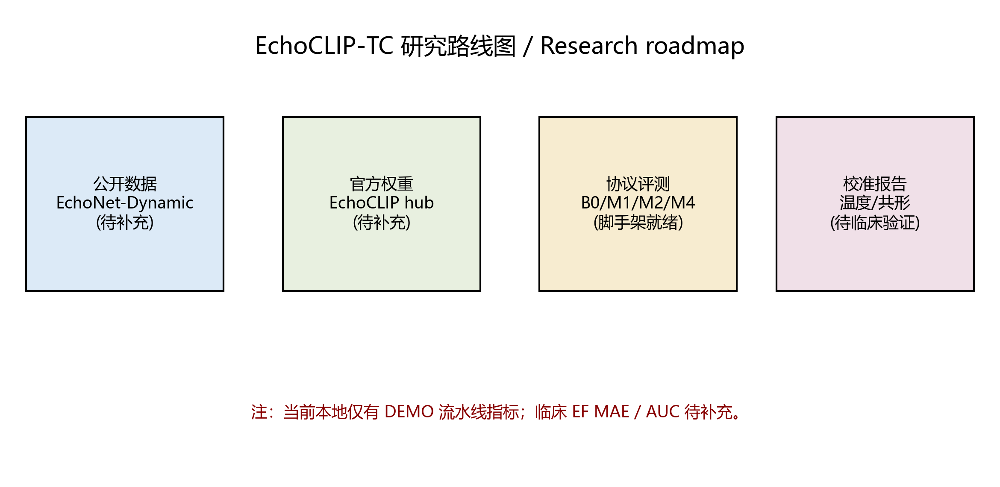
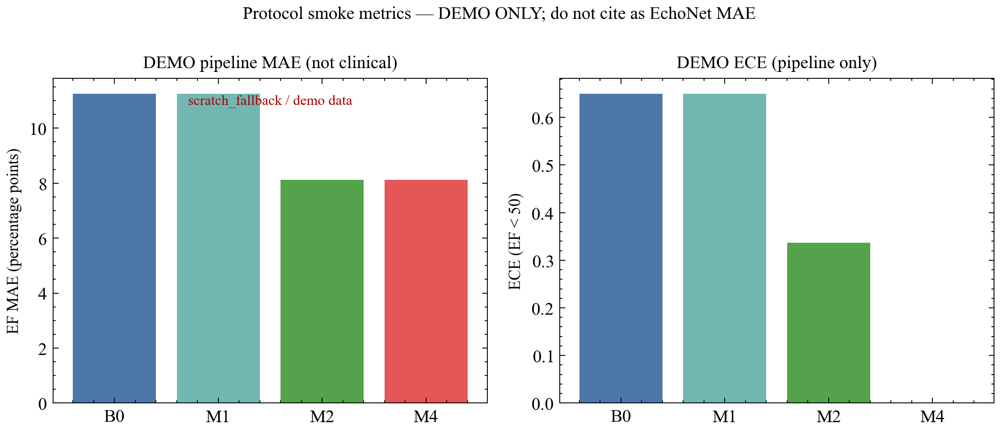
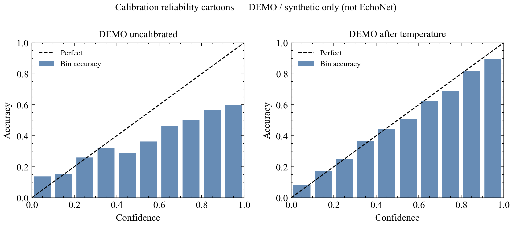
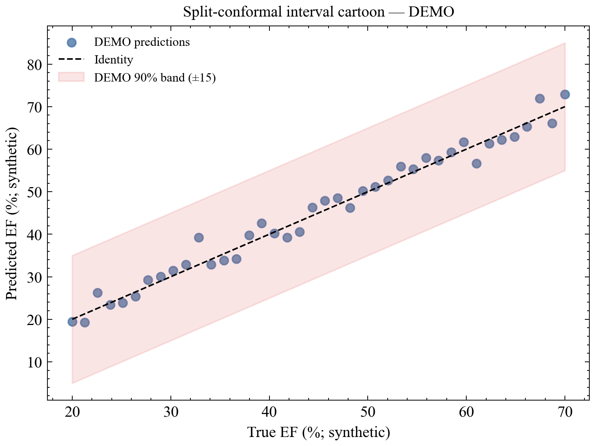

# EchoCLIP-TC 学术研究报告

**日期：** 2026-08-16  
**项目：** E:\\Projects\\20260522-EchoCLIP  
**GitHub：** https://github.com/Coucou2016/EchoCLIP-TC  
**并行稿：** `reports/research_report.html`（单文件自包含） / `papers/echoclip_tc_manuscript.md`  
**五轮日志：** `reports/echoclip_tc_five_round_collab_20260816.md`

> **DEMO ≠ 临床。** 下表与 DEMO 图不得写作 EchoNet EF MAE。Christensen et al. 外部 EF MAE ≈7.1% 为文献目标，非本地结果。磁盘检索未发现 EchoNet-Dynamic。

## 目录

1. 摘要  
2. 背景  
3. 方法  
4. 过程  
5. 结果  
6. 讨论  
7. 结论  
8. 局限  
9. 五轮协作  
10. 参考文献  

## 1. 摘要

EchoCLIP-TC 在冻结 EchoCLIP 双塔上增加时序聚合与 VAL-only 校准/共形评测，并锁定 B0/M1/M2/M4 协议。本地门禁通过；**临床指标待补充**（缺 EchoNet-Dynamic 与官方权重）。

## 2. 背景

帧级 VLM（EchoCLIP）与视频/多切面模型（EchoPrime、CardiacCLIP）之间，缺少「冻结权重 + 公平视频向量消融 + 校准报告」的可复现公开数据协议。写作宜模仿 Nat Med 叙事 + MICCAI 消融表 + 校准图。

## 3. 方法

见 PAPER.md / manuscript §3。要点：B0=`uniform`/frames；M1=`mixed`/mean；M2=`mixed`/temporal；M4=VAL-only cal。B0≠M1（非线性排序）。

**读图：** 左→右为数据流；下方为四模式。**结论：** 结构说明，无临床数值。

**读图：** 三列消融逻辑。**结论：** B0≠M1 语义成立；数值待 EchoNet。

## 4. 过程

- SciencePlots 重绘图至 `figures/`  
- manuscript Methods/Results/Discussion 成熟化  
- ChatGPT 浏览器 MCP blocked → 5 轮 surrogate + 粘贴包  
- 既有 live ChatGPT（B0/M1）：https://chatgpt.com/c/6a80922d-d1d0-83ea-970c-67b829457cd6  

## 5. 结果

### 5.1 临床

**待补充。**

### 5.2 DEMO 流水线（非临床；T=4）

| ID | DEMO MAE | DEMO ECE@50 | load_source | demo | n |
|----|----------|-------------|-------------|------|---|
| B0 | 11.25 | 0.6496 | scratch_fallback | yes | 32 |
| M1 | 11.25 | 0.6496 | scratch_fallback | yes | 32 |
| M2 | 8.125 | 0.3371 | scratch | yes | 32 |
| M4 | 8.125 | 0.0000 | scratch | yes | 32 |

## 6. 讨论

诚实创新面：时序模块、B0/M1 语义、校准协议、公开复现。不宣称私有大规模预训练或 DEMO 临床意义。EchoPrime / CardiacCLIP 仅作定位对照。

## 7. 结论

方法学脚手架就绪；临床表待官方资产。

## 8. 局限

无真实数据/权重；浏览器咨询受阻；DEMO 校准不可外推。

## 9. 五轮协作

见 `reports/echoclip_tc_five_round_collab_20260816.md`（5× surrogate；ChatGPT 新 URL unavailable）。

## 10. 参考文献

1. Christensen et al., Nat Med 2024, doi:10.1038/s41591-024-02959-y  
2. EchoPrime, Nature 2026;650:970–977, doi:10.1038/s41586-025-09850-x; arXiv:2410.09704  
3. CardiacCLIP, MICCAI 2025, arXiv:2509.17065  
4. Radford et al., CLIP, ICML 2021  
